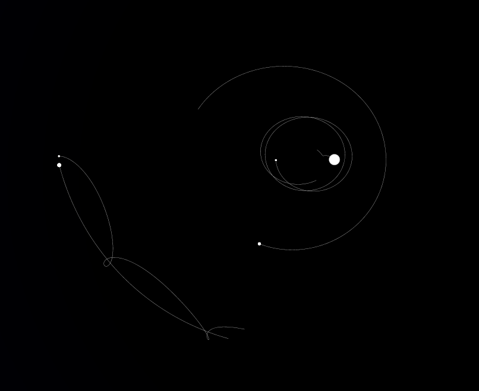

# galaxy
Gravitation simulation with Verlet integration

- Mouse to pan and zoom
- T to enable/disable drawing the trace of the bodies
- R to reset
- +/- to speed up the simulation. Note: this affects the error of the physics simulation
- Numbers 1..n to center the coordinate system on one of the bodies.

Touch support (rudimentary)
- Panning with one finger
- Zooming with pinching
- Three fingers simultaneously cycle through the bodies in the follow mode

